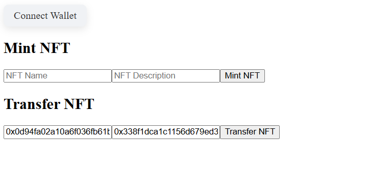
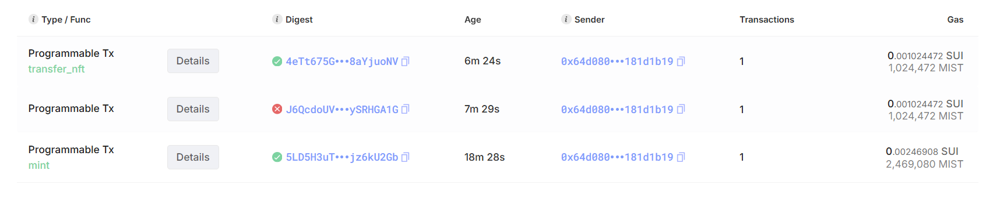

# 🧬 Sui NFT dApp — Mint & Transfer NFTs on Sui Testnet

This is a full-stack Sui Move + React dApp that allows users to:

- 🪙 Mint NFTs on the Sui testnet
- 🔄 Transfer NFTs to other Sui wallet addresses
- 🧠 Learn & showcase Sui smart contract and frontend integration

---

## 🖼️ Frontend UI Preview


## ✅ On-Chain Mint & Transfer Proof (Sui Explorer)


---

## 🧠 Technologies Used

- 🧾 Move Smart Contracts (Sui)
- ⚛️ React (Vite)
- 🧰 @mysten/sui.js & wallet-adapter-react
- 🔁 Connected to Sui Testnet
- 💡 Vite + TailwindCSS (optional for styling)

---

## 🧪 How to Use

### 🔧 1. Clone this repository
```bash
git clone https://github.com/navneet-saini2/sui-nft-dapp.git
cd sui-nft-dapp/frontend
📦 2. Install dependencies
bash
Copy
Edit
npm install
▶️ 3. Run the development server
bash
Copy
Edit
npm run dev
🧪 4. On the browser:
Connect your Sui Wallet (e.g., Suiet or Martian)

Fill NFT name + description → Click Mint NFT

Enter Object ID + Receiver Address → Click Transfer NFT

🚀 Deploy Smart Contract (CLI)
bash
Copy
Edit
sui move build
sui client publish --gas-budget 500000000